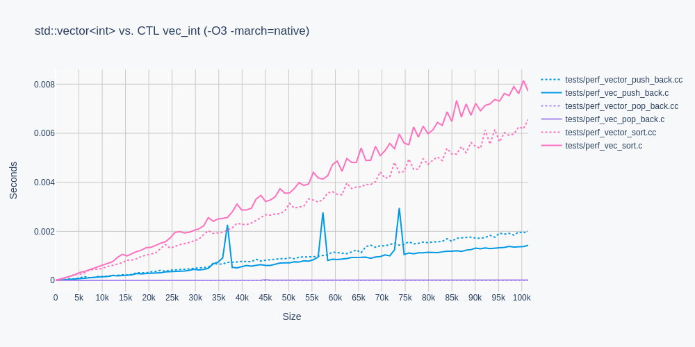
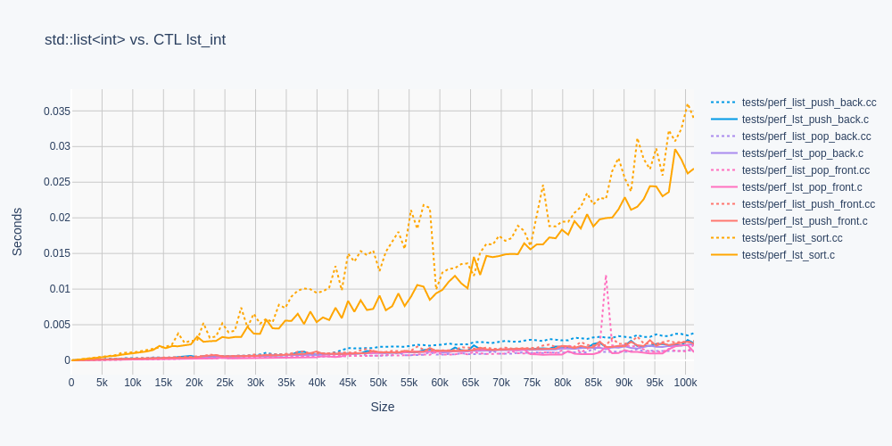

# C TEMPLATE LIBRARY (CTL)

CTL is a lightweight, type safe, header only, template library for ISO C99.

## Motivation

CTL back ports the following STL containers to C99 to make maximum use
of ISO C99's fast compile times and small binary sizes:

    deq.h -> std::deque
    lst.h -> std::list
    map.h -> std::map
    pqu.h -> std::priority_queue
    que.h -> std::queue
    set.h -> std::set
    stk.h -> std::stack
    str.h -> std::string
    vec.h -> std::vector

## Use

Configure a CTL container with a built-in or typedef type `T`.

    #include <stdio.h>

    #define P
    #define T int
    #include <vec.h>

    int compare(int* a, int* b) { return *b < *a; }

    int main(void)
    {
        vec_int a = vec_int_init();
        vec_int_push_back(&a, 9);
        vec_int_push_back(&a, 1);
        vec_int_push_back(&a, 8);
        vec_int_push_back(&a, 3);
        vec_int_push_back(&a, 4);
        vec_int_sort(&a, compare);
        foreach(vec_int, &a, it,
            printf("%d\n", *it.ref);
        )
        vec_int_free(&a);
    }

Definition `P` states type `T` is Plain Old Data (POD).

To compile, include the `ctl` directory:

    gcc main.c -I ctl

## Memory Ownership

Types with memory ownership require definition `P` be omitted, and require
function declarations for the C++ equivalent of the default constructor,
destructor, and copy constructor, prior to the inclusion of the container:

    typedef struct { ... } type;
    type type_init_default(void);
    void type_free(type*);
    type type_copy(type*);
    #define T type
    #include <vec.h>

## Performance

Performance measurements display CTL performance in solid colors, and STL
performance measurements in dotted colors. Template type `T` of type `int`
is used in all performance measurements.

## Running Tests
To run all functional tests, run:

    make

To run performance tests that generate graph output comparing CTL
and STL performance, run:

    make perf

Graphing requires Python3 and the Plotly family of libraries via pip3.

## Acknowledgements

Thank you `github.com/kully/` for the Plotly code, and thank you for the general review.
