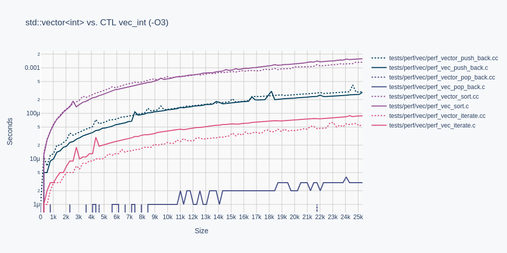
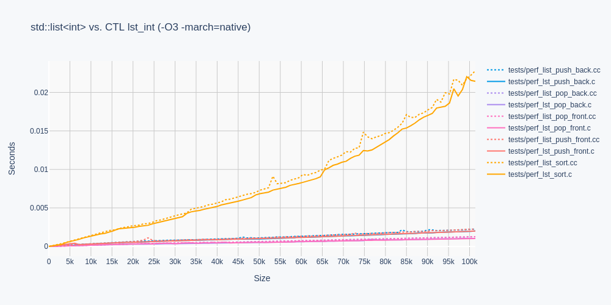
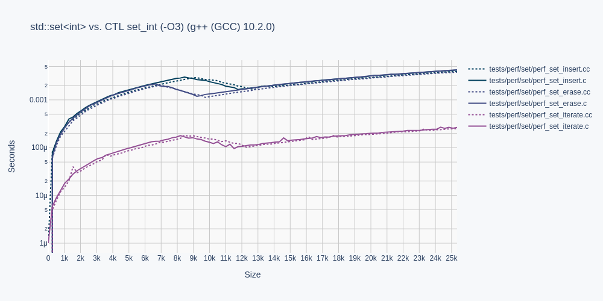
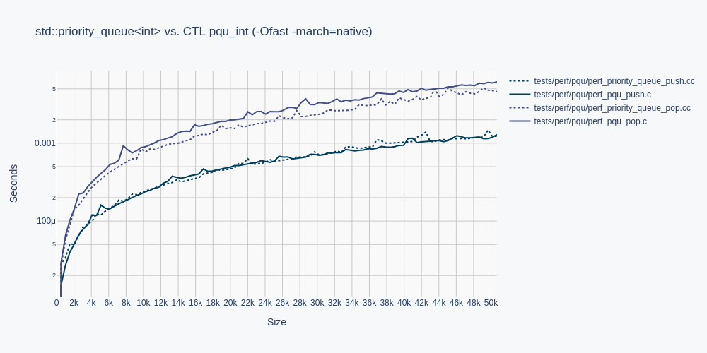
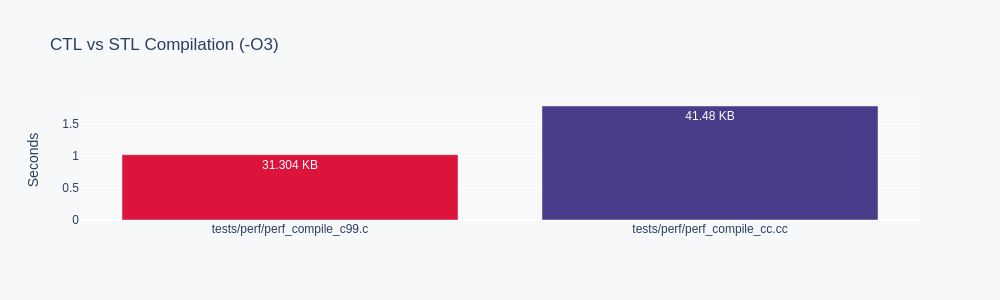

# C TEMPLATE LIBRARY (CTL)

CTL is a fast compiling, type safe, header only, template-like library for ISO C99/C11.

## Motivation

CTL aims to improve ISO C99/C11 developer productivity by implementing the following
STL containers in ISO C99/C11:

```
deq.h = std::deque
lst.h = std::list
pqu.h = std::priority_queue
que.h = std::queue
set.h = std::set
stk.h = std::stack
str.h = std::string
vec.h = std::vector
```

## Use

Configure a CTL container with a built-in or typedef type `T`.

```C
#include <stdio.h>

#define P
#define T int
#include <vec.h>

int compare(int* a, int* b) { return *b < *a; }

int main(void)
{
    vec_int a = vec_int_init();
    vec_int_push_back(&a, 9);
    vec_int_push_back(&a, 1);
    vec_int_push_back(&a, 8);
    vec_int_push_back(&a, 3);
    vec_int_push_back(&a, 4);
    vec_int_sort(&a, compare);
    foreach(vec_int, &a, it)
        printf("%d\n", *it.ref);
    vec_int_free(&a);
}
```

Definition `P` states type `T` is Plain Old Data (POD).

To compile, include the `ctl` directory:

```shell
gcc main.c -I ctl
```

For a much more thorough getting started guide,
see the wiki: https://github.com/glouw/ctl/wiki

## Memory Ownership

Types with memory ownership require definition `P` be omitted, and require
function declarations for the C++ equivalent of the destructor and copy constructor,
prior to the inclusion of the container:

```C
typedef struct { ... } type;
void type_free(type*);
type type_copy(type*);
#define T type
#include <vec.h>
```

Forgetting a declaration will print a human-readable error message:

```shell
tests/test_c11.c:11:11: error: ‘type_free’ undeclared (first use in this function)
   11 | #define T type
```

## Performance

CTL performance is presented in solid colors, and STL in dotted colors,
for template type `T` as type `int` for all measurements.








Omitted from these performance measurements are `que.h`, `stk.h`, and `str.h`,
as their performance characteristics can be inferred from `deq.h`, and `vec.h`,
respectively.

Note, CTL strings do not support short strings.

## Running Tests

To run all functional tests, run:

```shell
make
```

To compile examples, run:

```shell
make examples
```

To generate performance graphs, run:

```shell
sh gen_images.sh
# Graphing requires python3 and the Plotly family of libraries via pip3.
```

To do all of the above in one step, run:

```shell
./all.sh
```

For maintaining CTL, a container templated to type `int` can be
outputted to `stdout` by running make on the container name, eg:

```shell
make deq
make lst
make pqu
make que
make set
make stk
make str
make vec
```

## Other

STL `std::map` will not be implemented in CTL because maps only provide slight
syntactic improvements over sets.

STL `std::unordered_map` and `std::unordered_set` will not be implemented in CTL
because ordered containers are preferred, even at the cost of performance.

STL variants of multi-sets and multi-maps will not be implemented because
similar behaviour can be implemented as an amalgamation of a `set` and `lst`.

## Base Implementation Details

    vec.h: See `realloc`.
    deq.h: Paged `realloc`.
    lst.h: Doubly linked list.
    set.h: Red black tree.

## Acknowledgements

Thank you `kully` for the Plotly code, and thank you for the general review.
Thank you `smlckz` for the `foreach` cleanup.
